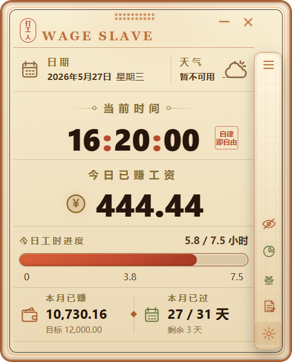

# Wage Slave



一款 Windows 桌面工资进度小组件，用 Electron + React 构建。它会根据工作时间和薪资设置实时计算今日、本月已赚工资，并以轻量悬浮窗的形式常驻桌面。

## 功能

- 实时显示当前时间、今日工资进度和本月累计工资。
- 支持月薪 / 日薪两种计算模式。
- 支持工作日、上下班时间、午休时间、主题、透明度等基础配置。
- 支持窗口置顶、隐私金额模式、边缘吸附和靠边收起。
- 支持系统托盘：
  - 右键显示、隐藏、重新显示和退出。
  - 双击托盘图标显示应用。
- 支持窗口控制：
  - 最小化到任务栏。
  - 关闭到系统托盘，保留后台托盘入口。
- 动态天气：
  - 根据配置城市动态获取天气、温度和 AQI。
  - 使用 Open-Meteo 免费接口，无需 API Key。
  - 内置 10 分钟缓存和请求超时保护。

## 技术栈

- Electron
- React
- Vite
- Lucide React
- Open-Meteo Weather / Air Quality API

## 本地运行

安装依赖：

```bash
npm install
```

启动渲染层开发服务器：

```bash
npm run dev
```

另开一个终端启动 Electron：

```bash
npm run electron:dev
```

构建生产资源：

```bash
npm run build
```

运行生产模式：

```bash
npm start
```

## 自动更新

应用使用 `electron-updater` + `electron-builder` 的 GitHub Releases provider 检测更新，发布仓库为 `fake-Wittem/Wage-Slave`。`npm run dist:github` 会把安装包和更新元数据上传到 GitHub draft Release；确认无误后手动 Publish Release，已安装客户端才会检测到新版本。

发布新版本时：

1. 更新 `package.json` 里的 `version`，并同步维护 `CHANGELOG.md`。
2. 清理 `release` 目录里旧的 `Wage Slave Setup *.exe` 和匹配的 `.blockmap` 文件。
3. 设置具备仓库 Release 权限的 `GH_TOKEN` 环境变量。
4. 运行 `npm run dist:github` 创建/更新 draft Release。
5. 在 GitHub Releases 页面检查 `latest.yml`、`Wage Slave Setup x.y.z.exe` 和对应 `.blockmap` 后发布 Release。

打包后的应用会在启动 30 秒后自动检查一次更新，也可以在设置面板或托盘菜单中手动检查。更新下载完成后，用户可以选择重启安装。

## 项目结构

```text
src/
  assets/      应用图标资源
  main/        Electron 主进程
  preload/     安全暴露给渲染层的 IPC API
  renderer/    React 小组件界面
```

## 说明

天气功能由主进程请求 Open-Meteo 接口，再通过 preload 暴露给渲染层，避免在前端组件中直接写网络请求细节。关闭按钮不会退出应用，只会隐藏窗口并保留系统托盘；需要完全退出时可通过托盘菜单选择“退出”。
